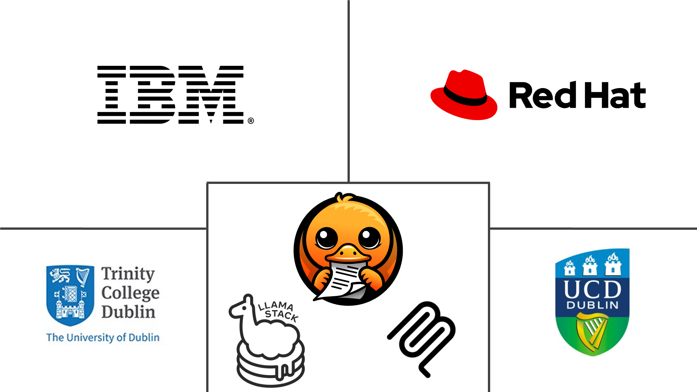

# AI Software Engineering Masterclass at Trinity College Dublin

Highlight of the demos:

- How to enhance the Llama Stack RAG with Docling.
    - Improved conversion and chunking
    - Adding multi-modality
    - Show results with visual grounding
- Make it agentic. Add Docling as MCP tool.

## Event details

See more at <https://github.com/trustyai-explainability/ai-masterclass-2025>
